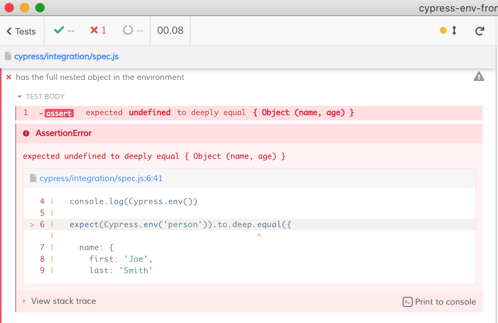

# cypress-env-from-cli-example

See [Cypress environment variables](https://on.cypress.io/environment-variables) guide

## Install

```
npm install
```

## Use

Without any arguments the test [cypress/integration/spec.js](./cypress/integration/spec.js) fails

```
npx cypress open
```



You need to pass the full object to be placed into `Cypress.env('person')`

```
npx cypress open --env person='{}'
```

## Working

```
$ npx cypress open --env person='{ "name": "hi", "age": 18 }'
plugins file has the config.env { person: { name: 'hi', age: 18 } }
```

## Not working

```
$ npx cypress open --env person='{ "name": {}, "age": 18 }'
Cypress encountered an error while parsing the argument env

You passed: person={ "name": {}, "age": 18 }

The error was: Cannot read property 'split' of undefined
```

To debug

```
$ DEBUG=cypress:server:args npx cypress open --env person='{ "name": {}, "age": 18 }'
```
